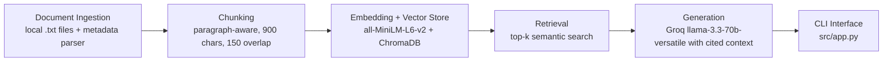

# Project 1 Planning: The Unofficial Guide

## Domain

My domain is student-generated housing advice for UC Berkeley students. This knowledge is valuable because official housing pages explain policies and options, but students often want practical advice about dorm social life, distance to campus, off-campus apartment searches, affordability, scams, co-ops, and places to avoid. That advice is scattered across Reddit threads and can be hard to search because students use informal language and compare options from personal experience.

## Documents

| # | Source | Description | URL or location |
|---|--------|-------------|-----------------|
| 1 | A Complete Guide for UC Berkeley New Admits - Housing | New-admit housing guide covering residence halls and the first-year guarantee | `data/raw/01_new_admits_housing_guide.txt` |
| 2 | freshman housing advice | Freshman dorm ranking discussion for Unit 1, Unit 2, Unit 3, Clark Kerr, and Blackwell | `data/raw/02_freshman_housing_advice_2024.txt` |
| 3 | Best recommended housing option for incoming UC Berkeley freshman | Dorm comparison across Blackwell, Foothill, Units, Stern, and Clark Kerr | `data/raw/03_best_freshman_housing_options.txt` |
| 4 | Freshman Housing: Advice | Tradeoffs among Unit 1, Unit 2, Clark Kerr, and Blackwell | `data/raw/04_freshman_housing_unit1_unit2_ck_blackwell.txt` |
| 5 | dorm advice | Clark Kerr vs Unit 1 advice focused on social life, room size, location, and food access | `data/raw/05_dorm_advice_ck_vs_unit1.txt` |
| 6 | Off-campus Housing Search Tips | When and where students suggest looking for off-campus housing | `data/raw/06_offcampus_housing_search_tips.txt` |
| 7 | Off campus housing recommendations? | Rent expectations, amenities, scams, and CalRentals advice | `data/raw/07_offcampus_housing_recommendations.txt` |
| 8 | cheap off campus housing options | Lower-cost options such as co-ops, lease takeovers, Facebook groups, and transit-accessible housing | `data/raw/08_cheap_offcampus_housing_options.txt` |
| 9 | Is the housing situation THAT bad? | High-level discussion of Berkeley housing difficulty and affordability | `data/raw/09_is_housing_that_bad.txt` |
| 10 | LIST OF PLACES YOU SHOULD !NOT! RENT | Subjective warning thread about specific buildings and property management issues | `data/raw/10_places_not_to_rent.txt` |

The original URLs for each Reddit thread are listed in `source_manifest.md` and in each raw document header.

## Chunking Strategy

**Chunk size:** 900 characters.

**Overlap:** 150 characters, only when a section is long enough to require splitting.

**Reasoning:** These starter documents are short Reddit-thread summaries and source notes, not long PDFs. Each file usually contains one complete student-advice topic, so paragraph-aware chunks preserve coherent thoughts better than a blind fixed-width split. A 900-character target is large enough to keep the title, summary, and short notes together when possible, while still small enough that retrieval can match focused questions about Clark Kerr, Unit 1, off-campus search timing, co-ops, or scams. The 150-character overlap protects the boundary when a long note has to be split.

## Retrieval Approach

**Embedding model:** `sentence-transformers/all-MiniLM-L6-v2`.

**Top-k:** 5 chunks.

**Production tradeoff reflection:** I chose `all-MiniLM-L6-v2` because it runs locally, is fast, and matches the recommended free stack for the assignment. For a production system, I would compare it against higher-accuracy embedding models with longer context windows and better performance on noisy social-media language. I would also weigh local privacy and cost against API-hosted latency, throughput, multilingual support, and whether the model can preserve fine distinctions between subjective student opinions and factual university policy.

## Evaluation Plan

| # | Question | Expected answer |
|---|----------|-----------------|
| 1 | Which UC Berkeley dorms do students recommend for freshmen who care about social life? | Unit 1, Unit 2, Unit 3, and Clark Kerr appear as social options, with tradeoffs around location, room size, and convenience. |
| 2 | What are the main tradeoffs between Clark Kerr and Unit 1? | Clark Kerr is described as more spacious and social/Greek-life adjacent but farther from campus; Unit 1 is described as more convenient and closer to food and activities. |
| 3 | When do students suggest starting the off-campus housing search? | Students suggest starting in spring semester, often around late February or early March, while noting April can still work but may be stressful. |
| 4 | What resources do students mention for finding off-campus housing? | Students mention Cal Rentals, Craigslist, Zillow, Trulia, Facebook groups, rental agencies, walking around for signs, lease takeovers, co-ops, and transit-accessible neighborhoods. |
| 5 | Which apartment has the objectively lowest crime risk near UC Berkeley? | The system should say it does not have enough information because the corpus contains subjective housing advice, not verified crime statistics. |

## Anticipated Challenges

1. The starter corpus contains summaries and selected notes rather than full Reddit threads, so retrieval may miss details that would exist in manually collected comments. If that happens, the fix is to paste permitted excerpts into `MANUAL_COLLECTION_SPACE` and rerun ingestion through embedding.

2. Some sources are subjective warning threads. The generation prompt must avoid turning student complaints into verified facts and should phrase them as student-reported experiences.

3. Short documents can produce small chunks with overlapping topics, so top-k retrieval may return multiple dorm-comparison chunks for an off-campus query. I will inspect retrieved chunks before trusting generated answers.

## Architecture

## AI Tool Plan

**Milestone 3 - Ingestion and chunking:** I will give ChatGPT/Codex my Documents and Chunking Strategy sections and ask it to implement `src/ingest.py` and `src/chunk.py`. I expect it to produce a metadata parser, noise cleaner, JSONL output, and paragraph-aware chunking function. I will verify by reading the generated `data/processed/documents.jsonl` and inspecting at least five chunks printed by `python src/chunk.py`.

**Milestone 4 - Embedding and retrieval:** I will give ChatGPT/Codex my Retrieval Approach and Architecture sections and ask it to implement `src/embed.py` and `src/retrieve.py` using `sentence-transformers` and ChromaDB. I expect scripts that store chunks in a persistent local vector database and print retrieved chunks with source metadata. I will verify by running the first three evaluation questions in retrieval-only mode and checking whether the returned chunks match the expected answers.

**Milestone 5 - Generation and interface:** I will give ChatGPT/Codex my grounding requirement, evaluation questions, and source-attribution requirement and ask it to implement `src/generate.py` and `src/app.py`. I expect a CLI that can answer one question or run interactively, always showing sources and retrieved chunks. I will verify by checking that unsupported questions say there is not enough information rather than inventing facts.
